# Production Scheduling — Manufacturing Guide (Visual)

**Purpose:** Explain how a part moves from **not yet scheduled** to **fully completed** — in plain manufacturing language with diagrams.

**Audience:** Plant management, production planners, manufacturing coordinators, supervisors, and operators.

**Companion viewer:** Open [view-scheduling-manufacturing-diagrams.html](./view-scheduling-manufacturing-diagrams.html) in a browser for scrollable interactive diagrams.

**Mermaid source (.mmd):** [view-mmd-manufacturing.html](./view-mmd-manufacturing.html) — view, copy, or download [scheduling-workflow-manufacturing.mmd](./scheduling-workflow-manufacturing.mmd).

**Architecture (Excalidraw):** [scheduling-architecture-roles.excalidraw](./scheduling-architecture-roles.excalidraw) — end-to-end scheduling with user roles (open in VS Code Excalidraw extension or [excalidraw.com](https://excalidraw.com)).

**Architecture (Eraser.io):** [pps-scheduling-end-to-end.eraserdiagram](./pps-scheduling-end-to-end.eraserdiagram) — professional BPMN swimlane block diagram ([how to open](./PPS_ERASER_DIAGRAM.md)).

**E2E role flowchart (only flowchart):** [view-pps-e2e-flowchart.html](./view-pps-e2e-flowchart.html) · [pps-e2e-role-flowchart.mmd](./pps-e2e-role-flowchart.mmd) — asset availability → breakdown / leave / OT / out-source → part completed.

**Doc index:** [README.md](./README.md) — which file to open for what.

---

## 1. The full circle — from plant setup to part done

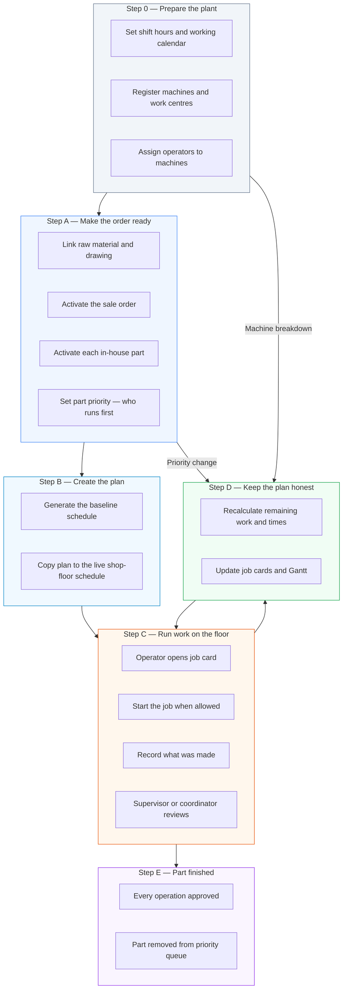

**In one sentence:** The plant is configured, orders and parts are made ready, a plan is built, operators run and record work, supervisors approve it, and the system keeps replanning until the part is done.

---

## 2. Two plans — what planners see vs what the floor sees

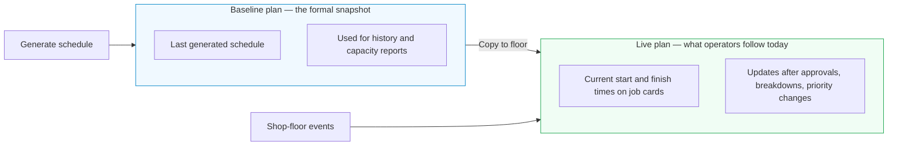

| Plan | Who uses it | When it changes |
|------|-------------|-----------------|
| **Baseline** | Management, planners | Only when someone runs a full schedule generation |
| **Live** | Operators, supervisors, coordinators | Automatically after approvals, breakdowns, and priority swaps |

---

## 3. What must be true before a part can be scheduled

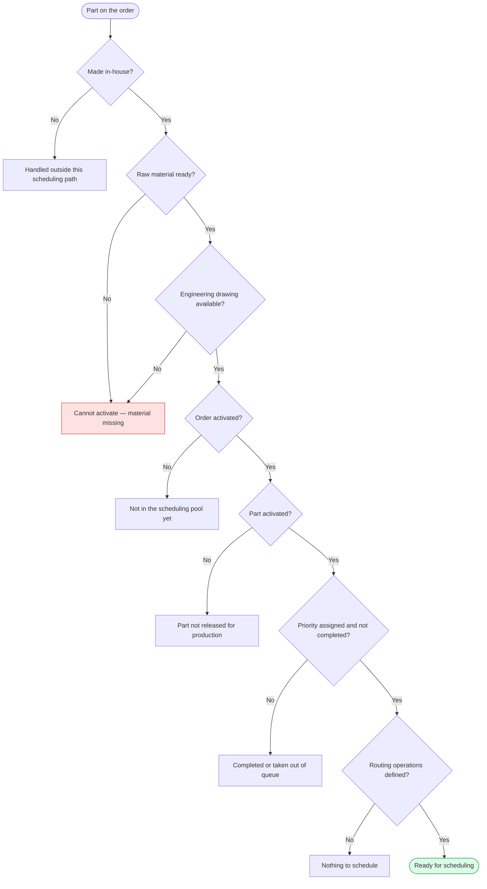

---

## 4. Who does what

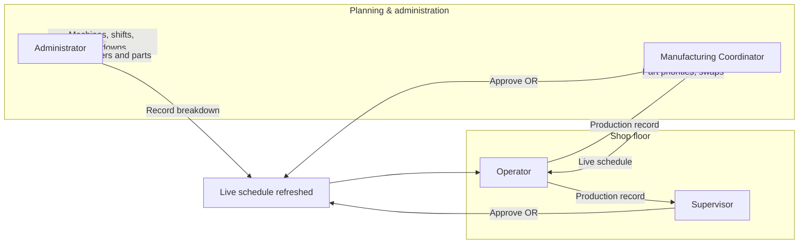

| Role | Main job in scheduling |
|------|------------------------|
| **Administrator** | Plant setup, machine status, order/part activation, exceptions |
| **Manufacturing Coordinator** | Part priority, swap decisions, may approve production |
| **Supervisor** | Approve production, quality decisions, floor oversight |
| **Operator** | Start jobs when allowed, record quantities, submit for approval |

**Approval rule:** For each production submission, **either** the supervisor **or** the manufacturing coordinator may approve — **not both**. Whoever approves first is recorded; the other is notified and cannot change that decision.

---

## 5. Operator job card — start, work, submit, wait for review

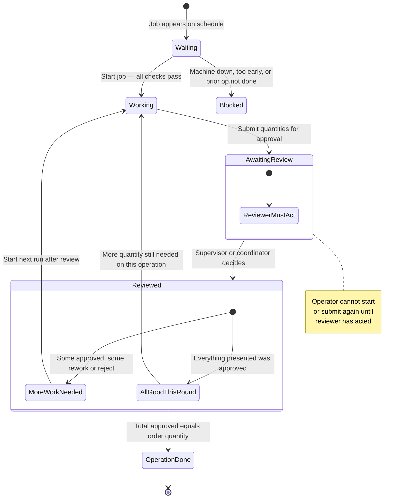

---

## 6. What the operator records — new work vs rework

After a review, the system knows how much work is still open. The operator enters two kinds of quantity:

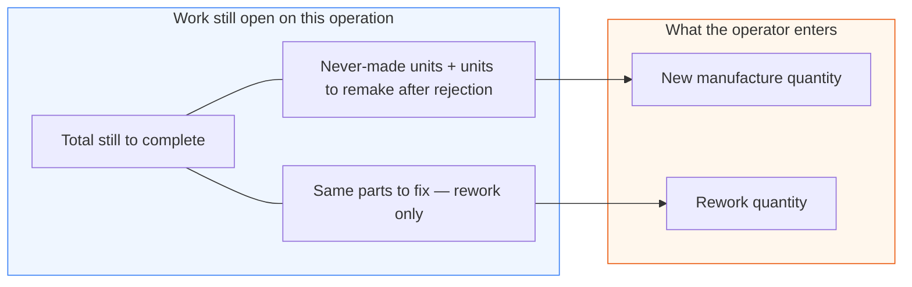

**Plain-language example — order quantity 10:**

| After review | Meaning |
|--------------|---------|
| 5 approved | Good parts accepted |
| 3 rework | Same 3 parts need correction — operator reworks them |
| 2 rejected | Those 2 must be made again from scratch |
| **5 still to do** | 3 rework + 2 remake (nothing left untouched) |

On the next run the operator may enter **up to 2** as new manufacture and **up to 3** as rework — in one submission or across separate job cycles.

---

## 7. When the system will not let the operator start a job

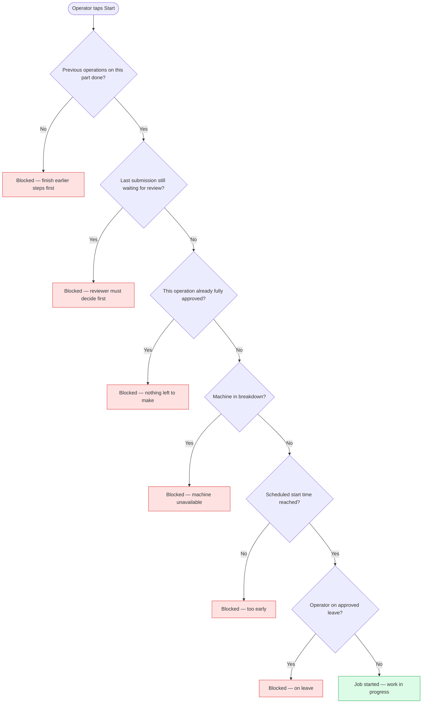

**Note:** Acknowledging reviewer feedback is **optional**. It does **not** stop the operator from starting the next run once the reviewer has acted.

---

## 8. Waiting for review — why the operator must pause

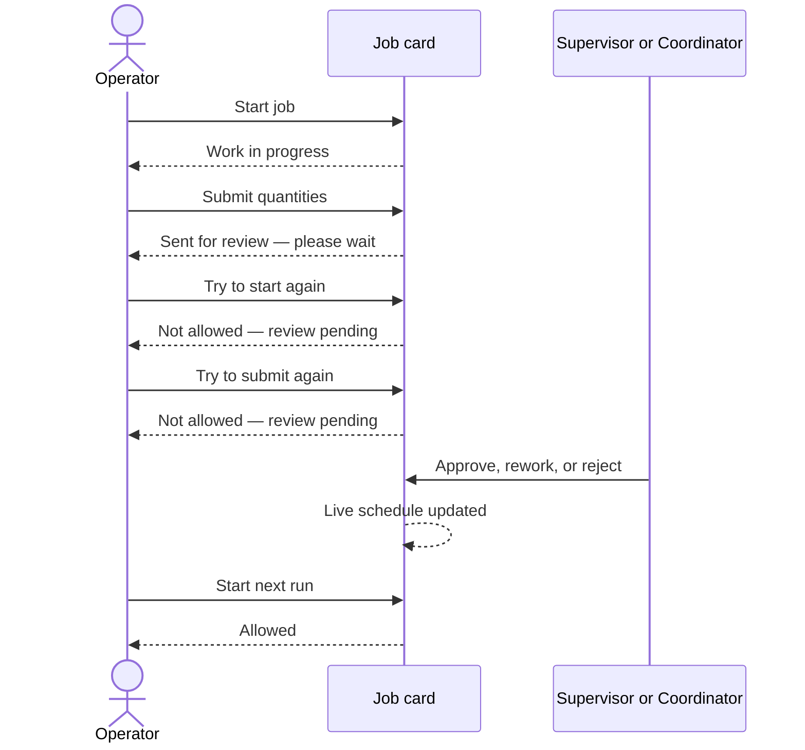

---

## 9. How the live schedule recalculates

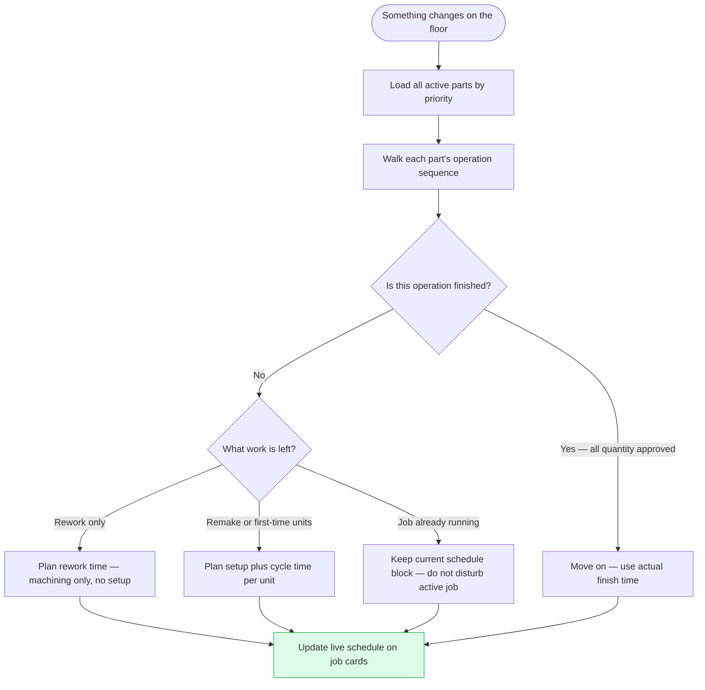

**What triggers a recalculation:**

| Event | Effect |
|-------|--------|
| Production approved, reworked, or rejected | Remaining work and times replanned |
| Machine marked unavailable or back in service | Affected jobs pushed or pulled |
| Part priority swapped | Higher-priority part may move ahead on shared machines |
| Full schedule regenerated | Baseline refreshed; live plan realigned |

---

## 10. Rework vs remake — different time on the schedule

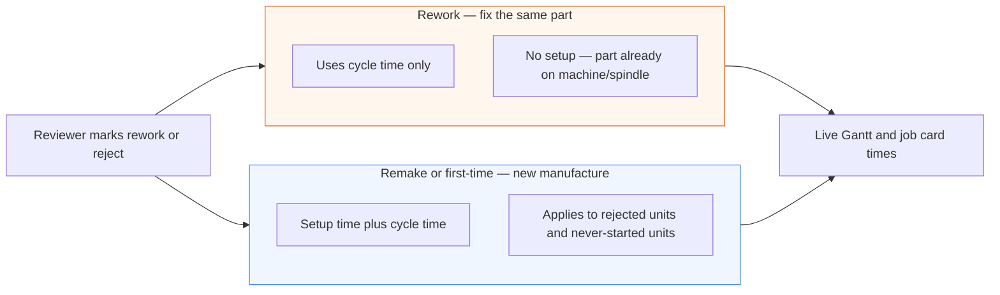

**Example:** If 3 units need rework and 2 must be remade, the scheduler plans a **shorter rework block** and a **longer new-manufacture block** (setup included). Long jobs may split across shift end — that is normal.

---

## 11. Machine breakdown — partial work is not lost

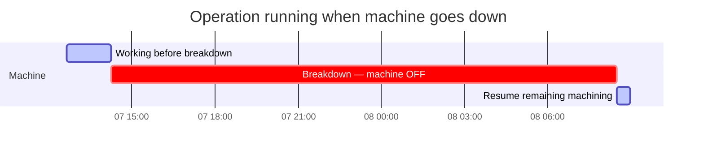

| Rule | What it means on the floor |
|------|----------------------------|
| Machine OFF | No new jobs can start during the breakdown window |
| Work already running | Pauses — remaining machining time continues after return |
| Setup not repeated | Partial cycle is preserved |
| Overnight breakdown | Work resumes when the machine is back — not at shift start if still down |

---

## 12. Changing which part runs first (priority swap)

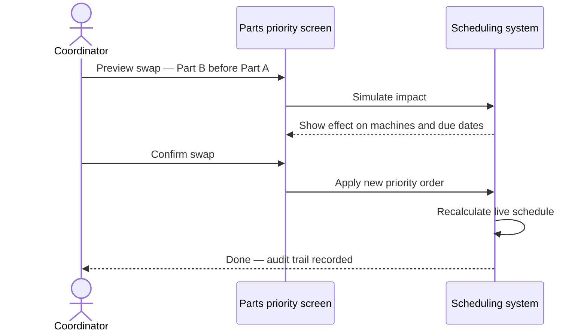

**Safety:** Priority swap is blocked while production is actively running on the affected parts.

---

## 13. Taking a part out of the queue (deactivation)

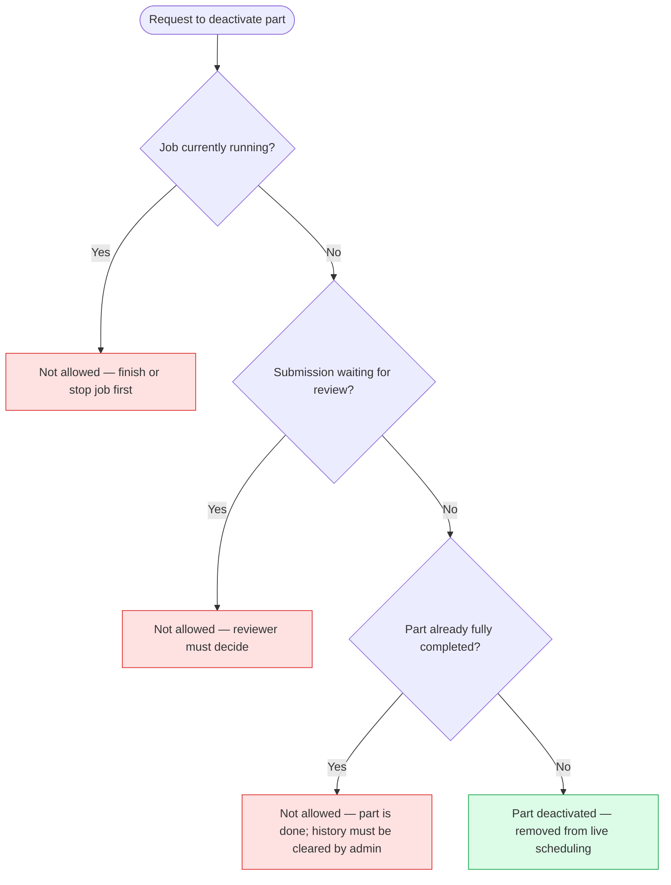

---

## 14. Typical week on the floor

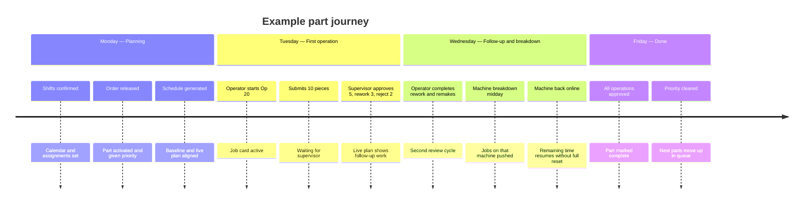

---

## 15. Common situations — what happens

| Situation | What the system does |
|-----------|----------------------|
| Operator submits then tries to start again immediately | Blocked until supervisor or coordinator reviews |
| Reviewer asks for rework only | Operator must record it as rework, not as new manufacture |
| Mix of rework and remakes | Operator can enter both in one submission or separate runs |
| Machine down overnight | Work resumes when machine returns, not at shift start if still down |
| Job running when schedule recalculates | Current job block kept — not wiped mid-run |
| Customer expedites a part | Coordinator simulates swap, commits if acceptable, schedule refreshes |
| Part finished | Removed from priority list; no longer competes for machines |
| Try to deactivate part mid-job | Blocked with clear reason per operation |

---

## 16. Glossary (manufacturing terms)

| Term | Meaning |
|------|---------|
| **Baseline plan** | Last formal generated schedule — for history and reporting |
| **Live plan** | Current times on job cards and Gantt — updates with reality |
| **Job card** | Operator screen for one operation: machine, times, start, submit |
| **Production log** | Record of what was made and whether it was approved |
| **Activation** | Operator officially starting an operation |
| **Breakdown** | Machine marked unavailable for a period |
| **Rework** | Fix the same part — no new setup on the schedule |
| **Reject / remake** | Scrap and manufacture again — setup applies |
| **Part priority** | Which in-house parts get machines first across all orders |
| **Priority swap** | Exchange positions of two parts in the queue |
| **Work centre** | Group of similar machines (e.g. turning, milling) |
| **Operation** | One step in the routing (e.g. Op 10, Op 20) |
| **Setup time** | One-time preparation before machining a batch |
| **Cycle time** | Time to machine one unit |

---

*This guide describes implemented system behaviour in manufacturing language. See [README.md](./README.md) for the full doc index.*
