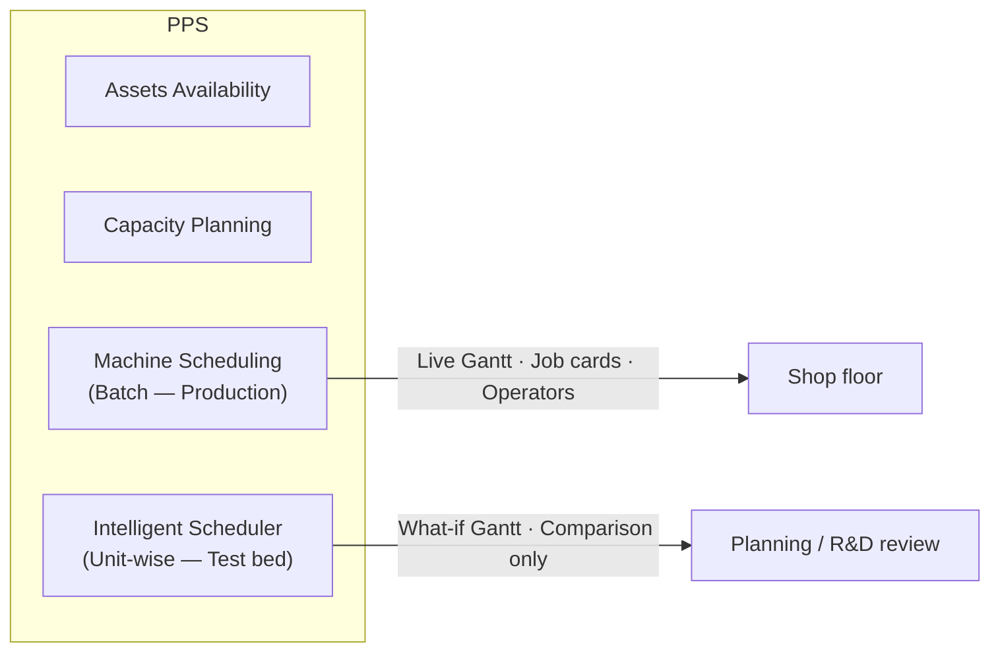
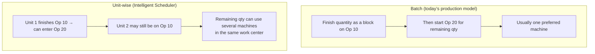
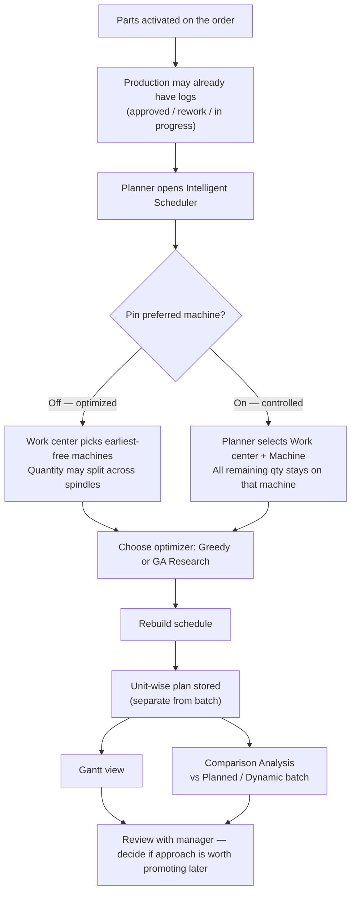
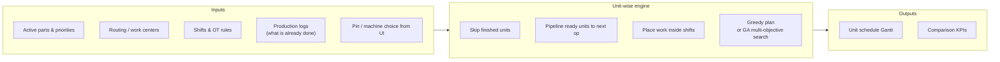
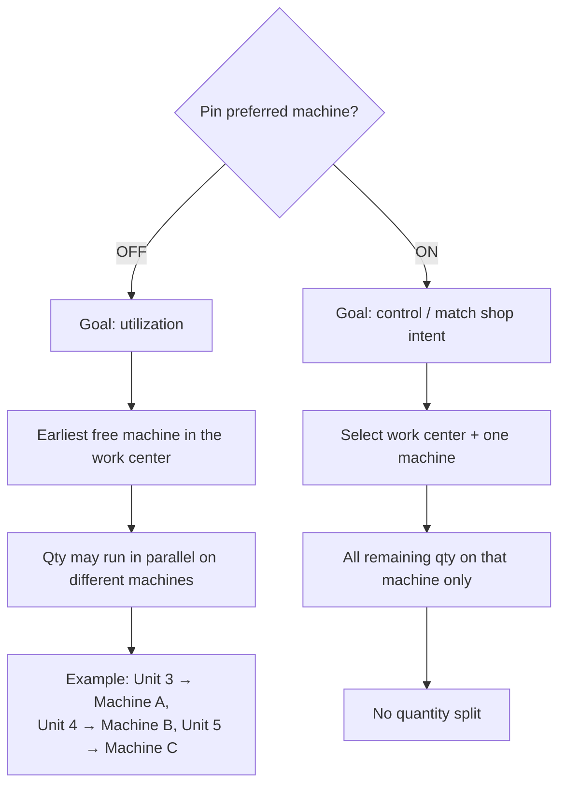
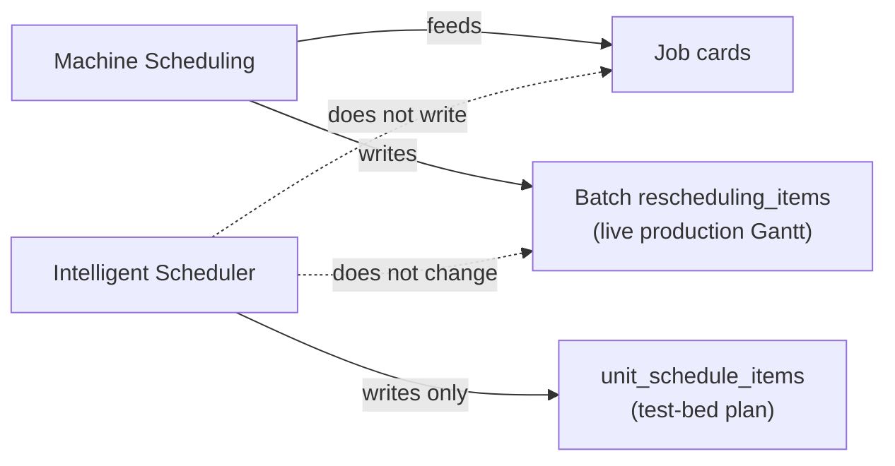
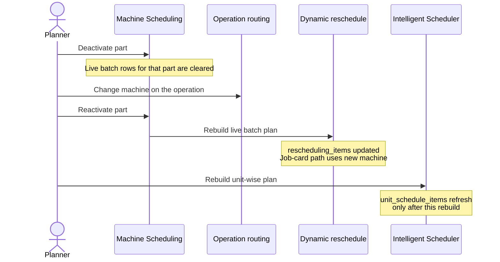

# Unit-Wise Scheduler — Manager Workflow Overview

**Audience:** Management / PPS leadership  
**Purpose:** Explain *what* the unit-wise (Intelligent) scheduler does, *how work flows*, and *how it differs from today’s batch shop-floor schedule* — without deep technical detail.

---

## 1. One-sentence summary

> Unit-wise scheduling plans **each piece (unit)** through operations with **pipelining** and optional **machine sharing inside a work center**, so we can test better machine utilization and earlier downstream starts — **without changing live job cards**.

---

## 2. Where it sits in PPS

| Area | Role |
|------|------|
| **Machine Scheduling** | Production schedule. Operators get job cards from here. |
| **Intelligent Scheduler** | Parallel **test bed**. Shows a unit-wise plan + comparison. Does **not** issue job cards. |

---

## 3. Core idea: Batch vs Unit-wise

**Manager takeaway**

- **Batch** = safe, operation-level cascade (shop floor today).
- **Unit-wise** = piece-level flow + optional split across work-center machines → often **less idle time** and **earlier completion** of later ops in simulation.

---

## 4. End-to-end workflow (non-technical)

---

## 5. What “Rebuild” considers

### After production has started

| Situation | Unit-wise behavior |
|-----------|-------------------|
| Some qty already **approved** on an op | Those units are treated as done; only **remaining** units are planned |
| Job card has a real **finish time** | Next remaining work uses that as continuity |
| Machine still running | That machine is treated as busy until the run can free |

Planner must click **Rebuild** after new logs — the plan does not auto-stream like a live operator board.

---

## 6. Pin preferred — the main control

**Example (part with Op 20 still open):**  
Changing routing to STC updates the **preferred** machine for batch.  
On Intelligent Scheduler:

- Pin **OFF** → STC is only one option in the WC; split can still happen.  
- Pin **ON** + STC → remaining Op 20 all on STC.

---

## 7. Optimizers (high level)

| Mode | What it optimizes for | When to use |
|------|----------------------|-------------|
| **Greedy** | Fast plan: earliest start, WC free machines, pipelining | Day-to-day what-if |
| **GA Research** | Searches trade-offs: due date, utilization, makespan, setups | Deeper study / demos |

Default GA selection policy is **balanced**: delivery → priority → utilization → makespan → setups.

---

## 8. What unit-wise does **not** do

- Operators continue to work from **Machine Scheduling**.  
- Unit-wise is for **planning review and comparison**, until leadership decides to promote it.

---

## 9. Machine change on an in-progress part (related shop flow)

If production needs a different machine (e.g. Tekcel → STC) while the part is active:

Production **logs are kept**. Batch Gantt updates on activate; unit-wise Gantt updates only after Intelligent Scheduler rebuild.

---

## 10. How to present this in 3 minutes

1. **Problem:** Batch waits for operation-level close; machines can sit idle; downstream ops start late.  
2. **Idea:** Plan **per unit**, allow **work-center sharing**, respect **real production progress**.  
3. **Safety:** Separate screen; **no job cards**; batch production untouched.  
4. **Control:** Pin OFF = optimize/split; Pin ON = force one machine.  
5. **Proof:** Gantt + Comparison Analysis vs current dynamic schedule.  
6. **Ask:** Continue pilot / compare more parts / later decide on production adoption.

---

## 11. Glossary (manager-friendly)

| Term | Meaning |
|------|---------|
| **Unit** | One piece of the order quantity |
| **Pipelining** | Next operation can start for a unit as soon as *that* unit finished the previous op |
| **Qty split** | Remaining pieces of the same op run on more than one machine in the same work center |
| **Pin preferred** | Force all remaining qty onto one chosen machine |
| **Batch / Dynamic** | Today’s live production schedule |
| **Intelligent Scheduler** | UI for the unit-wise test bed |

---

*Document location: `backend/cmf/docs/UNIT_WISE_SCHEDULER_MANAGER_WORKFLOW.md`*  
*Companion screens: PPS → Intelligent Scheduler (Gantt + Comparison Analysis).*
